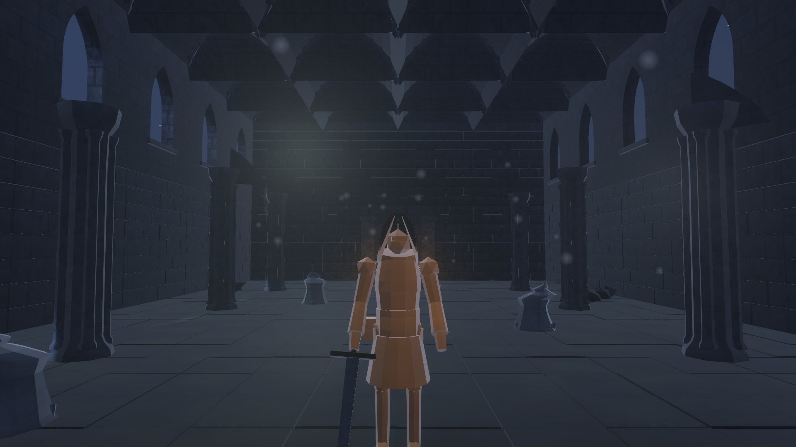
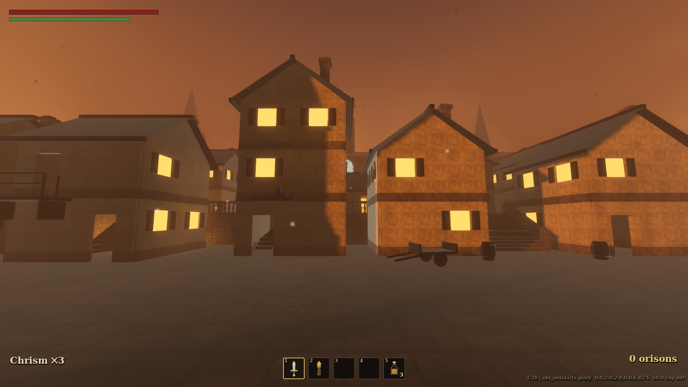
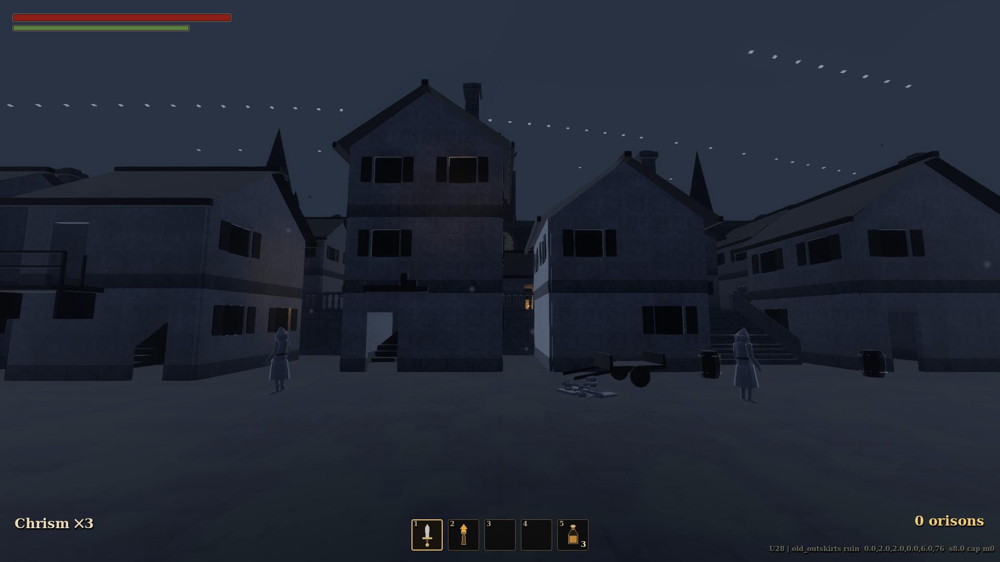
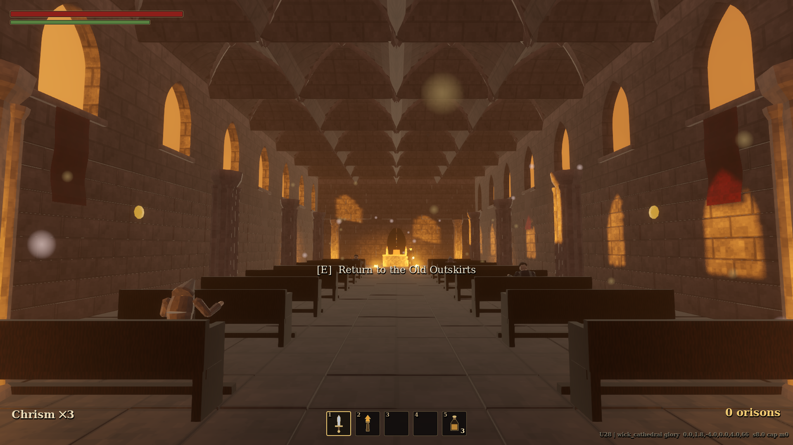

# VESPERGARD

*A gothic soulslike of glory and ruin.*



The Evening Kingdom fell on the night the sun set and did not rise. Its Vigil Lanterns still hold its memory. Walk each region as it **was** — radiant, peopled, safe — learn its halls, meet what remains of its court; then keep vigil, watch the memory gutter, and **fight back through the ruin it became**.

**Signature mechanic:** rest sites toggle the whole area between *glory* and *ruin*. Explore in glory; the gauntlet is ruin. Routes, people, dangers and music all shift with the world.

| | |
|---|---|
|  |  |
|  |  |

---

## The Kingdom

Eleven regions, each authored in both states, each with its own warden:

- **The Gray Cloister** — the teaching ground: garth, chandlery, bone garden, and the **Bellkeeper**'s yard.
- **The Basilica Porch & Terrace** — the gilded city overlook, close-ring houses, services.
- **The Basilica of Last Light** — full nave, triforium galleries, the Unrung Bell, the **Precentress** and her choir.
- **The Ossuary Undercroft** — the three-way underground link; the Watchers puzzle; the **Bell-Ox**.
- **The Larkspire** — a square-spiral songtower climb, the Daily Offices chime puzzle, gilded echoes that only hunt in glory, and the **Larkwarden** in an iron-caged summit arena open to the whole city.
- **The Black Gate** — drowned-sun ramparts, the capstan puzzle, the **Tollkeeper**.
- **The Drowned Marches** — the causeway through the fen; the **Ferryman** duels on a fenced jetty at the canal mouth.
- **Vigil's End** — the shrine at the kingdom's edge and the **First Vigilant**.
- **The Old Outskirts** — the town beneath the parish: lamplit lanes, word-stones, the clocktower square.
- **The Parish of the First Wick** — radiant by default, its congregation still praying; the Prior teaches the rites, and behind the lantern room waits **the Immortalized**, who fights the way you do — and does not stay down at half his wax.



## The Rites

Prior Anselm of the First Wick teaches magic for orisons. Learning your first rite kindles the **wick-bar** (mana):

- **Mend the Wick** — press the warm wax back into the wound.
- **Radiant Blast** — a thrown coal of remembered daylight.
- **Radiant Burst** — the whole candle at once; everything nearby learns what noon was.

Attune one rite in the satchel's **Rites** leaf (Tab) and cast it with **C**. Rest to rekindle the wick.

## Running the game

Requirements: [Godot 4.7 stable](https://godotengine.org/download/) (no export templates needed).

```sh
godot --path . 
```

Headless container / CI (software rendering):

```sh
xvfb-run -a -s "-screen 0 1920x1080x24" godot --path . --rendering-driver vulkan
```

### Controls (keyboard + mouse)

| Action | Key |
|---|---|
| Move / camera | WASD / mouse |
| Dodge roll (backstep if neutral) | Space |
| Sprint | Shift (hold) |
| Light attack | Left mouse |
| Heavy attack | Shift + Left mouse |
| Block | Right mouse (hold) |
| Parry | Q |
| Use Chrism Flask | R |
| Cast attuned rite | X |
| Girdle slots (weapons, torch, flask) | 1–5 |
| Satchel & Rites | Tab |
| Interact / loot / vigil | E |
| Lock-on / switch target | Middle mouse |
| Menu / pause | Esc |

Gamepad: standard soulslike layout (RB/RT light/heavy, LB block, LT parry, B roll/sprint, X flask, A interact, RS click lock-on).

## Packaging a standalone build (send it to a friend)

The game exports to a single self-contained executable — the player does NOT
need Godot.

**Zero-setup route:** GitHub Actions builds both platforms on every push
(`.github/workflows/export.yml`). Open the repo's **Actions** tab, pick the
latest "Export game builds" run, and download `vespergard-windows` /
`vespergard-linux` from its Artifacts. That file alone is the game.

**Local route:** install Godot 4.7 plus the export templates
(`godot --headless --install-export-templates`, or Editor > Manage Export
Templates). Then:

```sh
tools/export.sh            # Linux + Windows executables into build/
tools/export.sh Windows    # just one platform
```

`export_presets.cfg` ships in the repo (Linux + Windows Desktop, embedded
.pck). The exported binary is functionally identical to running from the
editor: all content is data-driven from `data/` and pre-baked assets — no
editor-only dependencies, no dev tools included (`tools/`, docs and pipeline
scripts are excluded from the pack). Saves go to the platform `user://` dir.

## Rebuilding generated content (optional)

All assets are generated and committed; you only need these to *regenerate*:

```sh
pip install bpy==4.5.11   # Blender 4.5 LTS as a Python module
python3 tools/gen_assets.py      # gothic kit (157 pieces) + painterly maps -> assets/
python3 tools/gen_ui_art.py      # hotbar/rite icons + splash -> assets/ui/
python3 tools/audio/synth.py     # synthesized SFX/ambience -> assets/audio/*.wav
```

Boss battle hymns (one per warden), NPC voice lines and the credits reel audio
were generated with ElevenLabs and are committed under `assets/audio/` — no
key or regeneration needed to play or build.

## Verification harness

```sh
tools/test.sh                    # all headless suites (combat, death loop, areas, bosses, FULL LOOP)
tools/test.sh fullloop           # just the scripted end-to-end playthrough
tools/gallery.sh                 # screenshot every main space in both states -> docs/gallery/
tools/shot.sh OUT.png [args]     # one framed shot (see src/debug/shot.gd for flags)
```

Every area ships with a steered-capsule test scene (`tools/test/<area>_test.gd`)
that walks its routes, rings its puzzles, and fells its warden headlessly.

All assets are original and generated in-repo (Blender `bpy` + PIL + Python
synth + ElevenLabs music/voice); no third-party game assets are used.

## Repository map

```
src/            gameplay code (autoloads, player, combat, enemies, world, ui)
shaders/        the shared gothic shader family + transformation wave
data/           areas, weapons, enemies, spells, npcs, dialogue — the game as data
assets/         generated kit (.glb), textures, audio, voice, fonts, ui art
tools/          blender generators, audio synth, screenshot + sim harnesses
DECISIONS.md    architecture decisions + rationale
ROADMAP.md      what's real, what's shallow, what's next
```
