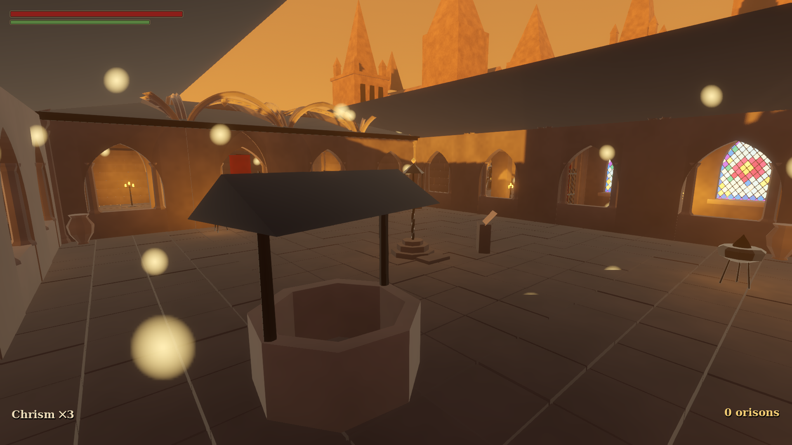
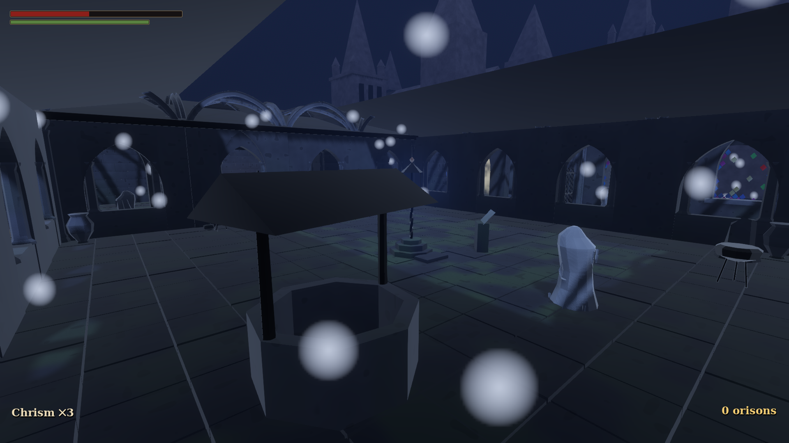
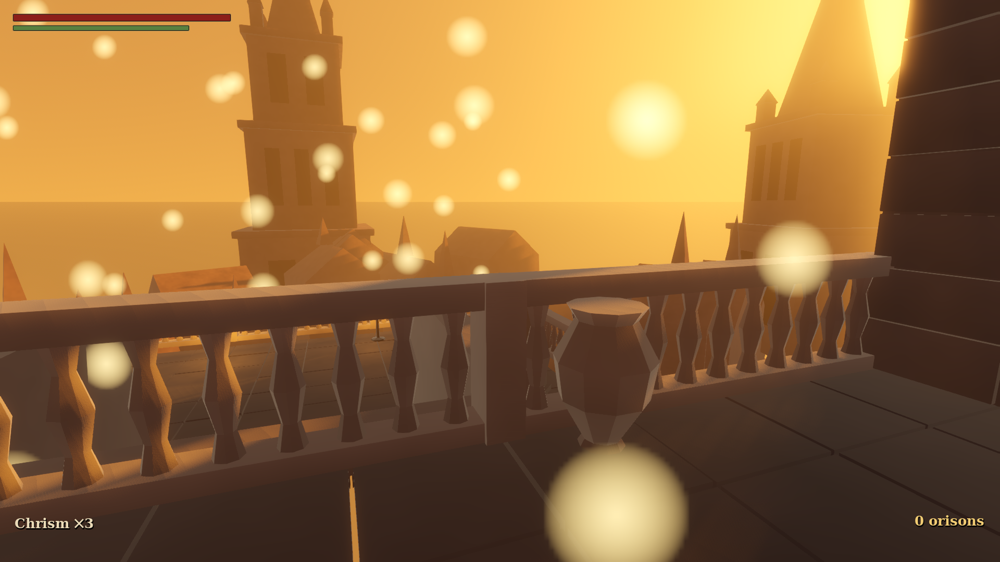

# VESPERGARD

*A gothic soulslike of glory and ruin.*





The Evening Kingdom fell on the night the sun set and did not rise. Its Vigil Lanterns still hold its memory. Walk each region as it **was** — radiant, peopled, safe — learn its halls, meet what remains of its court; then keep vigil, watch the memory gutter, and **fight back through the ruin it became**.

**Signature mechanic:** rest sites toggle the whole area between *glory* and *ruin*. Explore in glory; the gauntlet is ruin. Routes, people, dangers and music all shift with the world.

---

## Running the game

Requirements: [Godot 4.7 stable](https://godotengine.org/download/) (no export templates needed).

```sh
godot --path . 
```

Headless container / CI (software rendering):

```sh
xvfb-run -a -s "-screen 0 1920x1080x24" godot --path . --rendering-driver vulkan
```

### Controls (keyboard + mouse)

| Action | Key |
|---|---|
| Move / camera | WASD / mouse |
| Dodge roll (backstep if neutral) | Space |
| Sprint | Shift (hold) |
| Light attack | Left mouse |
| Heavy attack | Shift + Left mouse |
| Block | Right mouse (hold) |
| Parry | Q |
| Use Chrism Flask | R |
| Interact / loot / vigil | E |
| Lock-on / switch target | Tab or Middle mouse |
| Menu / pause | Esc |

Gamepad: standard soulslike layout (RB/RT light/heavy, LB block, LT parry, B roll/sprint, X flask, A interact, RS click lock-on).

## Rebuilding generated content (optional)

All assets (models, textures, audio) are generated and committed; you only need these to *regenerate*:

```sh
pip install bpy==4.5.11   # Blender 4.5 LTS as a Python module
python3 tools/gen_assets.py      # gothic kit → assets/kit/*.glb
python3 tools/audio/synth.py     # audio pack → assets/audio/*.wav
```

## Verification harness

```sh
tools/test.sh                    # all headless suites (combat, death loop, area, boss, FULL LOOP)
tools/test.sh fullloop           # just the scripted end-to-end §11 playthrough
tools/gallery.sh                 # screenshot every main space in both states -> docs/gallery/
tools/shot.sh OUT.png [args]     # one framed shot (see src/debug/shot.gd for flags)
```

All assets are original and generated in-repo (Blender `bpy` + Python synth);
no third-party game assets are used.

## Repository map

```
src/            gameplay code (autoloads, player, combat, enemies, world, ui)
shaders/        the shared gothic shader family + transformation wave
data/           areas, weapons, enemies, npcs, dialogue — the game as data
assets/         generated kit (.glb), audio, fonts
tools/          blender generators, audio synth, screenshot + sim harnesses
DECISIONS.md    architecture decisions + rationale
ROADMAP.md      what's real, what's shallow, what's next
```
